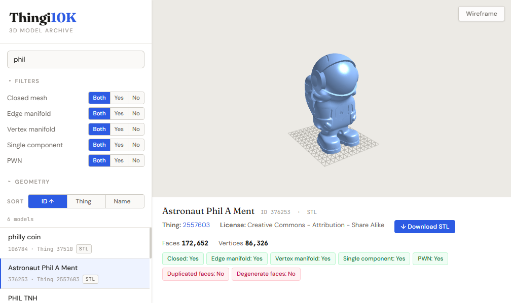

# Thingi10K Browser

A searchable, filterable 3D model archive browser for the [Thingi10K dataset](https://ten-thousand-models.appspot.com) — 10,000 3D-printable models from Thingiverse, with mesh quality metadata.

[](https://larsbrubaker.github.io/Thingi10K/)

**[▶ Live Demo](https://larsbrubaker.github.io/Thingi10K/)**

---

## Features

- **Search** by model name, ID, or Thing ID
- **Filter** by mesh quality properties (closed, edge/vertex manifold, single component, PWN) — each with three states: Both / Yes / No
- **Filter** by face and vertex count ranges
- **Sort** by ID, Thing ID, or name
- **3D preview** with orbit controls and wireframe toggle
- **Download** any mesh directly from the browser (decompressed on the fly)

## Architecture

The live demo is a fully static site hosted on GitHub Pages — no server required.

| Layer | Detail |
|-------|--------|
| Frontend | Vanilla JS + Three.js, served from `docs/` via GitHub Pages |
| Model metadata | `docs/data/models.json` — all 10 K records, ~3 MB |
| Mesh files | Compressed per-model zips in three companion repos, served via jsDelivr CDN |
| Decompression | [fflate](https://github.com/101arrowz/fflate) — in-browser, no server needed |

### Mesh repos

| Repo | ID range | Models |
|------|----------|--------|
| [Thingi10K-meshes-1](https://github.com/larsbrubaker/Thingi10K-meshes-1) | 32 770 – 88 580 | 3 333 |
| [Thingi10K-meshes-2](https://github.com/larsbrubaker/Thingi10K-meshes-2) | 88 581 – 301 929 | 3 333 |
| [Thingi10K-meshes-3](https://github.com/larsbrubaker/Thingi10K-meshes-3) | 301 930 – 1 778 123 | 3 334 |

Each mesh is stored as a deflate-compressed zip (e.g. `32770.stl.zip`). The browser fetches and decompresses on demand — no files are pre-extracted.

## Running locally

```bash
# Requires Rust + the Thingi10K.zip dataset (not in repo — see dataset source above)
cd Thingi10K
cargo run
# Open http://localhost:3000
```

The local server reads directly from `Thingi10K.zip` with no extraction needed.

## Regenerating static output

If you update the zip (e.g. replace a model), regenerate with:

```bash
cargo run --bin export_static
# Writes docs/data/models.json and mesh-export/meshes-{1,2,3}/
```

Then push `mesh-export/meshes-N/` to the corresponding mesh repo.

## Dataset

**Thingi10K** — [ten-thousand-models.appspot.com](https://ten-thousand-models.appspot.com)  
10,000 models from Thingiverse with mesh quality annotations (closed, manifold, PWN, etc.).
